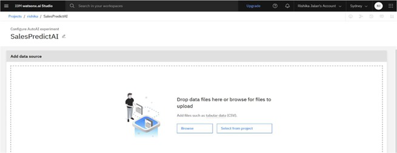
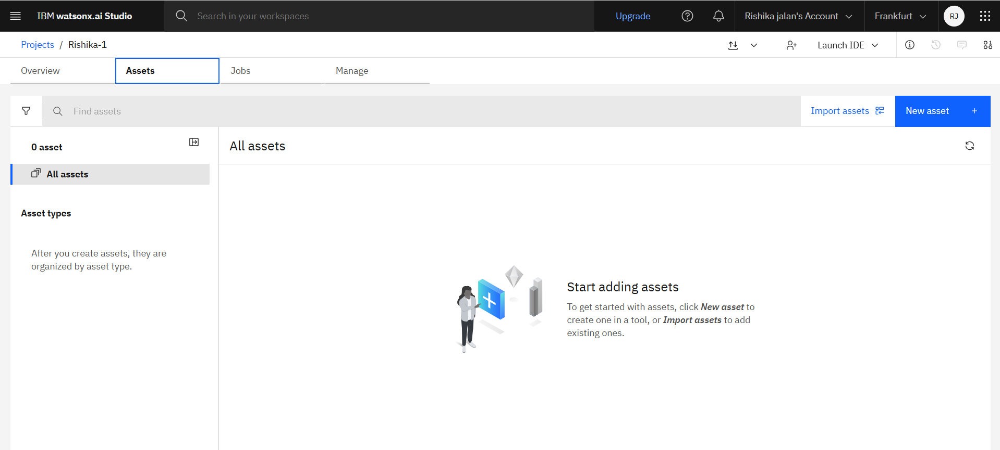
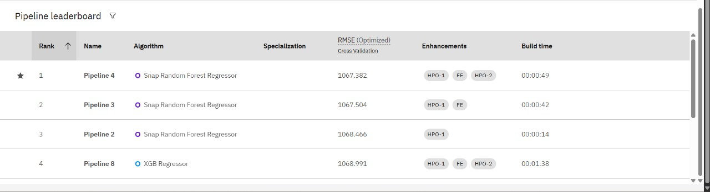
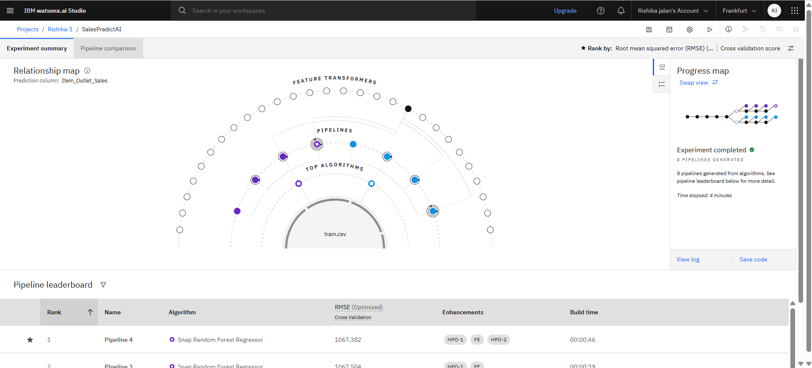
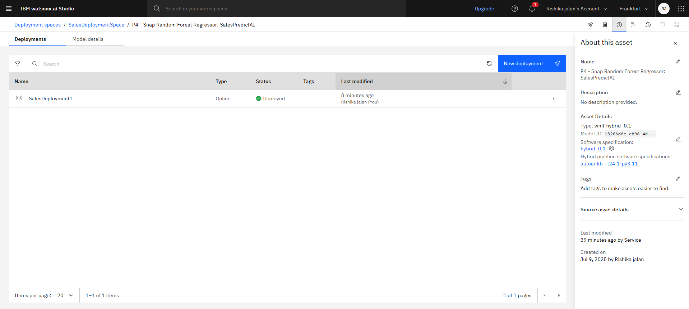

# 🛒 Big Mart Sales Prediction using IBM watsonx.ai AutoAI

This project demonstrates how to predict sales for Big Mart stores by automating the machine learning workflow using **IBM watsonx.ai AutoAI**.  
With AutoAI, we quickly built, evaluated, and compared multiple pipelines without manual coding — streamlining data preprocessing, feature engineering, and model selection.  
The goal is to forecast `Item_Outlet_Sales` based on historical data to help retailers make data-driven decisions.  
By leveraging AutoAI, we turned a complex ML process into a faster, repeatable, and more accessible solution.

---

## 📦 Dataset

- **Dataset:** Big Mart Sales Prediction Dataset
- **Target variable:** `Item_Outlet_Sales` (total sales of each product per outlet)
- Contains features like:
  - `Item_Weight`
  - `Item_Fat_Content`
  - `Item_Visibility`
  - `Outlet_Identifier`
  - `Outlet_Location_Type`
  - etc.

*(Data source: public datasets, e.g., Kaggle — https://www.kaggle.com/datasets/shivan118/big-mart-sales-prediction-datasets)*

---

## 🧪 Workflow

1. Uploaded dataset to IBM watsonx.ai studio.
2. Created an **AutoAI experiment**, selecting `Item_Outlet_Sales` as the target.
3. AutoAI automatically:
   - Handled missing values
   - Engineered new features
   - Trained multiple pipelines using algorithms like XGBoost, LGBM, etc.
4. Evaluated models on validation data; selected best based on RMSE/R².
5. Generated predictions on test data.

---

## ⚙️ Tools & Technologies

- 🧠 IBM watsonx.ai studio
- 🤖 AutoAI service
- 📊 Python (for optional EDA and evaluation)
- 📂 CSV dataset files

---

## 📊 Results

| Metric      | Score (example) |
|------------:|----------------:|
| R² (Validation) | 0.601 |
| RMSE         | 1067.382 |

---

## 🖼 Screenshots

| Step | Screenshot |
|-----|-----------:|
| Dataset Upload |  |
| AutoAI Experiment Setup |  |
| Leaderboard of Pipelines |  |
| Pipeline Visualization |  |
| Deployment Step |  |

---

## ✨ What I Learned

- Automating the ML pipeline creation with AutoAI
- Comparing multiple models and metrics
- Visualizing and understanding AutoAI pipelines
- Deploying models as APIs on watsonx.ai

---

## ✅ Conclusion

Using **IBM watsonx.ai AutoAI**, we successfully built an end-to-end pipeline for predicting Big Mart store sales.  
The automated process simplified complex ML tasks — from feature engineering to model selection and deployment — and delivered reliable results with minimal manual coding.  
This project demonstrates the power of AutoAI in accelerating machine learning workflows and making advanced AI accessible to everyone.

---
## ✍️ Author

**Rishika Jalan**  
- 📧 rishikajalan23.set@modyuniversity.ac.in
- 🌐 www.linkedin.com/in/rishika-jalan-b97785289

